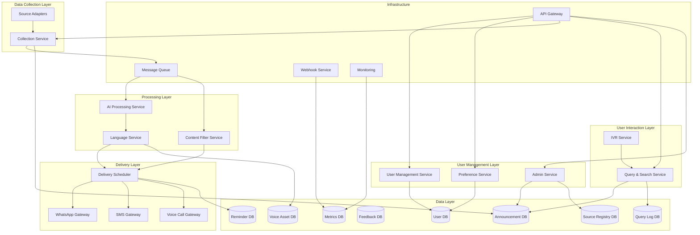

# Design Document: AI-Powered Community Noticeboard System

## Overview

The AI-powered community noticeboard system is designed as a microservices-based architecture that automatically collects, processes, queries, and distributes local community announcements through multiple communication channels. The system supports both push-based notifications and pull-based user queries, including voice-first access for low-literacy users.

The architecture follows an event-driven design pattern where announcement collection triggers processing workflows, and user-initiated queries are handled through a dedicated search service.

## Architecture

The system employs a microservices architecture with the following key principles:

- **Event-Driven Communication**: Services communicate through message queues to ensure loose coupling and reliability
- **Horizontal Scalability**: Each service can be scaled independently based on load
- **Fault Tolerance**: Circuit breakers and retry mechanisms ensure system resilience
- **Data Consistency**: Event sourcing maintains audit trails and enables system recovery
Query / Search Service

### High-Level Architecture Diagram



## Components and Interfaces

### Collection Service

**Responsibility**: Orchestrates the collection of announcements from various external sources.

**Key Functions**:
- Manages source adapter lifecycle and scheduling
- Handles duplicate detection and deduplication
- Implements retry logic with exponential backoff
- Publishes collected announcements to the processing pipeline

**Interfaces**:
```
interface CollectionService {
    collectFromSource(sourceId: string): Promise<Announcement[]>
    scheduleCollection(sourceId: string, interval: Duration): void
    registerSourceAdapter(adapter: SourceAdapter): void
    getCollectionStatus(sourceId: string): CollectionStatus
}

interface SourceAdapter {
    sourceId: string
    collect(): Promise<RawAnnouncement[]>
    validateConnection(): Promise<boolean>
    getLastCollectionTime(): Date
}
```

### AI Processing Service

**Responsibility**: Transforms raw announcements into structured, summarized content suitable for delivery.

**Key Functions**:
- Generates concise summaries while preserving essential information
- Extracts structured data (dates, locations, categories)
- Handles processing failures with fallback mechanisms
- Maintains processing audit trails

**Interfaces**:
```
interface AIProcessingService {
    processAnnouncement(raw: RawAnnouncement): Promise<ProcessedAnnouncement>
    extractMetadata(content: string): Promise<AnnouncementMetadata>
    generateSummary(content: string, maxWords: number): Promise<string>
    validateProcessing(processed: ProcessedAnnouncement): boolean
}
```

### Content Filter Service

**Responsibility**: Evaluates announcement relevance and appropriateness for different user segments.

**Key Functions**:
- Calculates geographic relevance scores
- Categorizes announcements by type and urgency
- Filters inappropriate or spam content
- Applies user-specific interest matching

**Interfaces**:
```
interface ContentFilterService {
    calculateRelevanceScore(announcement: ProcessedAnnouncement, user: User): Promise<number>
    categorizeAnnouncement(announcement: ProcessedAnnouncement): Promise<Category[]>
    isAppropriate(announcement: ProcessedAnnouncement): Promise<boolean>
    matchesUserInterests(announcement: ProcessedAnnouncement, interests: string[]): boolean
}
```

### Language Service

**Responsibility**: Handles translation and localization of content for different user language preferences.

**Key Functions**:
- Translates summaries to target languages
- Adapts content for cultural context
- Generates text-to-speech compatible content
- Maintains translation quality metrics

**Interfaces**:
```
interface LanguageService {
    translate(content: string, targetLanguage: string): Promise<string>
    generateSpeechText(content: string, language: string, dialect?: string): Promise<string>
    detectLanguage(content: string): Promise<string>
    validateTranslation(original: string, translated: string): Promise<number>
}
```

### User Management Service

**Responsibility**: Manages user accounts, authentication, and basic profile information.

**Key Functions**:
- Handles user registration and authentication
- Manages contact information and verification
- Processes opt-out requests and data deletion
- Maintains user activity logs

**Interfaces**:
```
interface UserManagementService {
    registerUser(userData: UserRegistration): Promise<User>
    updateUser(userId: string, updates: Partial<User>): Promise<User>
    deleteUser(userId: string): Promise<void>
    verifyContact(userId: string, channel: DeliveryChannel): Promise<boolean>
    getUsersByLocation(location: GeoLocation, radius: number): Promise<User[]>
}
```

### Preference Service

**Responsibility**: Manages user delivery preferences, interests, and notification settings.

**Key Functions**:
- Stores and retrieves user preferences
- Handles preference inheritance and defaults
- Manages interest categories and weights
- Processes preference change notifications

**Interfaces**:
```
interface PreferenceService {
    getPreferences(userId: string): Promise<UserPreferences>
    updatePreferences(userId: string, preferences: Partial<UserPreferences>): Promise<void>
    getDeliverySchedule(userId: string): Promise<DeliverySchedule>
    isInQuietHours(userId: string, timestamp: Date): Promise<boolean>
}
```

### Query & Search Service

**Responsibility**: Handles all user-initiated information requests.

**Interfaces**:
```
interface QueryService {
    searchAnnouncements(query: string, userId: string): Promise<ProcessedAnnouncement[]>
    getLatestByCategory(category: Category, location: GeoLocation): Promise<ProcessedAnnouncement[]>
    logQuery(userId: string, query: string): Promise<void>
}

```

### Admin Service

**Responsibility**: Manages manual announcement submission and moderation.

**Interfaces**:
```
interface AdminService {
    submitAnnouncement(adminId: string, content: string): Promise<RawAnnouncement>
    approveAnnouncement(adminId: string, announcementId: string): Promise<void>
    rejectAnnouncement(adminId: string, announcementId: string): Promise<void>
    getPendingAnnouncements(): Promise<RawAnnouncement[]>
}


```

### Webhook Service

**Responsibility**: Notifies partner systems about delivery events.

**Interfaces**:
```
interface WebhookService {
    registerWebhook(partnerId: string, url: string): void
    sendDeliveryEvent(announcementId: string, status: DeliveryStatus): Promise<void>
}


```

### Delivery Scheduler

**Responsibility**: Orchestrates the delivery of announcements to users through appropriate channels and timing.

**Key Functions**:
- Schedules deliveries based on user preferences
- Manages delivery queues and rate limiting
- Handles emergency notification prioritization
- Tracks delivery status and retries

**Interfaces**:
```
interface DeliveryScheduler {
    scheduleDelivery(announcement: ProcessedAnnouncement, users: User[]): Promise<void>
    scheduleEmergencyDelivery(announcement: ProcessedAnnouncement, area: GeoArea): Promise<void>
    getDeliveryStatus(deliveryId: string): Promise<DeliveryStatus>
    retryFailedDelivery(deliveryId: string): Promise<void>
}
```

### Channel Gateways (WhatsApp, SMS, Voice)

**Responsibility**: Handle the actual delivery of messages through specific communication channels.

**Key Functions**:
- Format messages for channel-specific requirements
- Handle channel-specific authentication and rate limits
- Process delivery confirmations and failures
- Maintain channel health monitoring

**Interfaces**:
```
interface ChannelGateway {
    sendMessage(recipient: string, content: DeliveryContent): Promise<DeliveryResult>
    formatContent(announcement: ProcessedAnnouncement, preferences: UserPreferences): DeliveryContent
    validateRecipient(recipient: string): Promise<boolean>
    getChannelStatus(): ChannelStatus
}
```
## Public APIs

### User API
**Auth**: User JWT / OTP

POST /query  
Purpose: Search announcements using natural language. 
``` 
Request:
{
  query: string
}
Response:
{
  results: ProcessedAnnouncement[]
}

```
POST /feedback  
Purpose: Submit usefulness rating.  
```
Request:
{
  announcementId: string,
  rating: number
}

```
GET /announcements/search  
Purpose: Filtered search by category and location.

POST /ivr/input  
Purpose: Handle keypad/voice input from IVR system.

---

### Admin API
**Auth**: Admin JWT (role-based)

POST /admin/announcements  
Purpose: Manual submission by verified admins.

GET /admin/pending  
Purpose: List unapproved announcements.

POST /admin/approve  
POST /admin/reject  

---

### Partner API
**Auth**: API Key + Signature

POST /partner/announcement  
Purpose: Direct submission by organizations.

POST /partner/webhook/register  
Purpose: Register delivery webhook.


## Data Models

### Core Entities

```typescript
interface RawAnnouncement {
    id: string
    sourceId: string
    originalContent: string
    collectedAt: Date
    sourceMetadata: Record<string, any>
    contentType: string
    originalUrl?: string
}

interface ProcessedAnnouncement {
    id: string
    rawAnnouncementId: string
    title: string
    summary: string
    fullContent: string
    category: Category[]
    urgencyLevel: UrgencyLevel
    location?: GeoLocation
    eventDate?: Date
    actionRequired?: string
    processedAt: Date
    processingVersion: string
}

interface User {
    id: string
    contactInfo: ContactInfo
    location: GeoLocation
    registeredAt: Date
    lastActiveAt: Date
    verificationStatus: VerificationStatus
    optOutStatus: OptOutStatus
}

interface UserPreferences {
    userId: string
    deliveryChannels: DeliveryChannelPreference[]
    language: string
    dialect?: string
    interests: string[]
    deliveryFrequency: DeliveryFrequency
    quietHours: TimeRange
    emergencyOverride: boolean
    relevanceThreshold: number
}

interface DeliveryRecord {
    id: string
    announcementId: string
    userId: string
    channel: DeliveryChannel
    status: DeliveryStatus
    scheduledAt: Date
    deliveredAt?: Date
    failureReason?: string
    retryCount: number
}

interface Source {
    id: string
    name: string
    type: string
    adapterType: string
    lastCollectionTime: Date
    reliabilityScore: number
    active: boolean
}

interface AdminUser {
    id: string
    role: 'moderator' | 'publisher'
    organization: string
    verified: boolean
    createdAt: Date
}


interface Feedback {
    id: string
    userId: string
    announcementId: string
    rating: number
    comment?: string
    createdAt: Date
}

interface VoiceAsset {
    announcementId: string
    language: string
    dialect?: string
    audioUrl: string
    durationSeconds: number
    generatedAt: Date
}

interface Reminder {
    id: string
    announcementId: string
    userId: string
    triggerAt: Date
    delivered: boolean
    createdAt: Date
}

interface QueryLog {
    id: string
    userId: string
    query: string
    responseCount: number
    timestamp: Date
}

```

### Supporting Types

```typescript
enum Category {
    EMERGENCY = 'emergency',
    EVENT = 'event',
    SERVICE = 'service',
    GOVERNMENT = 'government',
    COMMUNITY = 'community',
    HEALTH = 'health',
    TRANSPORTATION = 'transportation',
    UTILITIES = 'utilities'
}

enum UrgencyLevel {
    CRITICAL = 'critical',
    HIGH = 'high',
    MEDIUM = 'medium',
    LOW = 'low'
}

enum DeliveryChannel {
    WHATSAPP = 'whatsapp',
    SMS = 'sms',
    VOICE = 'voice'
}

enum DeliveryFrequency {
    IMMEDIATE = 'immediate',
    HOURLY = 'hourly',
    DAILY = 'daily',
    WEEKLY = 'weekly'
}

interface GeoLocation {
    latitude: number
    longitude: number
    radius?: number
    address?: string
    postalCode?: string
}

interface ContactInfo {
    phoneNumber: string
    whatsappNumber?: string
    email?: string
    preferredName: string
}
```

## Correctness Properties

*A property is a characteristic or behavior that should hold true across all valid executions of a system—essentially, a formal statement about what the system should do. Properties serve as the bridge between human-readable specifications and machine-verifiable correctness guarantees.*

Before defining the correctness properties, let me analyze the acceptance criteria to determine which ones are testable as properties.

<function_calls>
<invoke name="prework">
<parameter name="featureName">ai-community-noticeboard

Based on the prework analysis, the following correctness properties ensure the system behaves correctly across all valid inputs:

### Property 1: Complete Collection with Metadata Preservation
*For any* configured source and collection operation, all new announcements should be retrieved and stored with complete original metadata including source, timestamp, and category information.
**Validates: Requirements 1.1, 1.5**

### Property 2: Exponential Backoff Retry Pattern
*For any* source that becomes unavailable, retry attempts should follow exponential backoff intervals and all failures should be logged with appropriate detail.
**Validates: Requirements 1.2**

### Property 3: Duplicate Announcement Deduplication
*For any* set of announcements collected from multiple sources, duplicate announcements should be merged into single entries while preserving all source references.
**Validates: Requirements 1.3**

### Property 4: Summary Word Limit Compliance
*For any* processed announcement, the generated summary should not exceed 150 words while containing all essential information from the original content.
**Validates: Requirements 2.1**

### Property 5: Language Preference Matching
*For any* user and processed announcement, the delivered content should be in the user's preferred language and dialect as specified in their preferences.
**Validates: Requirements 2.2, 4.3**

### Property 6: Error Handling with Logging and Fallback
*For any* processing failure, error handling, or inappropriate content detection, the system should log detailed information and attempt appropriate fallback actions.
**Validates: Requirements 2.4, 3.3, 8.3**

### Property 7: Metadata Extraction Completeness
*For any* announcement processed by the AI service, key information fields (date, time, location, action required) should be extracted and properly formatted when present in the source content.
**Validates: Requirements 2.5**

### Property 8: Geographic Relevance Scoring
*For any* announcement and user location, announcements geographically closer to the user should receive higher relevance scores than those farther away.
**Validates: Requirements 3.1**

### Property 9: Valid Category Assignment
*For any* processed announcement, the system should assign at least one valid category from the defined category enumeration.
**Validates: Requirements 3.2**

### Property 10: Interest-Based Priority Scoring
*For any* announcement and user with specified interests, announcements matching the user's interests should receive higher priority scores than non-matching announcements.
**Validates: Requirements 3.4**

### Property 11: Relevance Threshold Filtering
*For any* announcement and user, only announcements with relevance scores above the user's configured threshold should proceed to delivery scheduling.
**Validates: Requirements 3.5**

### Property 12: Channel-Specific Message Formatting
*For any* announcement delivered via WhatsApp, SMS, or voice, the message should be formatted according to channel-specific requirements and constraints.
**Validates: Requirements 4.1, 4.2**

### Property 13: Delivery Fallback Chain
*For any* failed delivery attempt, the system should attempt delivery through alternative channels based on the user's preference ordering.
**Validates: Requirements 4.4**

### Property 14: Comprehensive Delivery Tracking
*For any* delivery attempt, the system should record delivery status, timing, and outcome while tracking all specified metrics for monitoring and analytics.
**Validates: Requirements 4.5, 8.1, 8.2**

### Property 15: Complete User Registration Data Collection
*For any* user registration, all required fields (contact information, preferred language, location, delivery preferences) should be collected and validated.
**Validates: Requirements 5.1**

### Property 16: User Preference Enforcement
*For any* user preference update, the changes should immediately affect all subsequent delivery decisions including scheduling, filtering, and channel selection.
**Validates: Requirements 5.2, 5.5, 6.1**

### Property 17: Complete Opt-Out Processing
*For any* user who opts out, all future deliveries should be prevented and personal data should be removed within the specified timeframe, except for emergency contact information.
**Validates: Requirements 5.3, 10.4**

### Property 18: Emergency Override Behavior
*For any* announcement classified as emergency, it should bypass normal filtering, scheduling, and preference restrictions to reach all users in the affected geographic area.
**Validates: Requirements 6.2, 10.1**

### Property 19: Digest Mode Compilation
*For any* user with digest delivery frequency, multiple announcements should be compiled into single deliveries according to the user's schedule.
**Validates: Requirements 6.3**

### Property 20: Load Distribution Scheduling
*For any* set of scheduled deliveries, delivery times should be distributed across time periods to prevent system overload during peak periods.
**Validates: Requirements 6.4**

### Property 21: Delivery Queue Management
*For any* user reaching delivery frequency limits, additional announcements should be queued for the next scheduled delivery window.
**Validates: Requirements 6.5**

### Property 22: Complete Data Persistence
*For any* stored announcement or user data, all required metadata and processing history should be persisted, with PII fields encrypted in storage.
**Validates: Requirements 7.1, 7.2**

### Property 23: Automatic Data Archival
*For any* announcement older than 90 days, it should be automatically moved to archive storage to maintain system performance.
**Validates: Requirements 7.4**

### Property 24: Daily Report Generation
*For any* day of system operation, comprehensive reports should be generated containing all specified performance and user activity metrics.
**Validates: Requirements 8.4**

### Property 25: Threshold-Based Scaling Response
*For any* performance metric exceeding configured thresholds, the system should trigger appropriate scaling actions or administrator alerts.
**Validates: Requirements 8.5**

### Property 26: API Validation and Authentication
*For any* external API submission, the source should be validated and authenticated before processing according to the same rules as collected content.
**Validates: Requirements 9.1, 9.2**

### Property 27: Webhook Delivery Notification
*For any* announcement delivered that originated from a partner organization, appropriate webhook notifications should be sent to confirm delivery.
**Validates: Requirements 9.3**

### Property 28: API Rate Limit Enforcement
*For any* API request exceeding rate limits, appropriate error codes and retry guidance should be returned to the client.
**Validates: Requirements 9.4**

### Property 29: Comprehensive API Audit Logging
*For any* API interaction, complete audit logs should be maintained with all required security and compliance information.
**Validates: Requirements 9.5**

### Property 30: Multi-Channel Emergency Delivery
*For any* emergency notification, delivery should be attempted simultaneously through all configured channels for maximum reach and comprehensive logging.
**Validates: Requirements 10.2, 10.5**

### Property 31: Emergency Processing Speed Priority
*For any* emergency announcement, processing time should be faster than normal announcements while maintaining accuracy requirements.
**Validates: Requirements 10.3**

## Error Handling

The system implements comprehensive error handling across all components:

### Collection Errors
- **Source Unavailability**: Exponential backoff retry with circuit breaker pattern
- **Data Format Issues**: Graceful degradation with manual review queue
- **Authentication Failures**: Automatic credential refresh with fallback mechanisms

### Processing Errors
- **AI Service Failures**: Fallback to rule-based processing with reduced functionality
- **Translation Errors**: Fallback to original language with notification to user
- **Content Filtering Errors**: Conservative approach - block suspicious content

### Delivery Errors
- **Channel Failures**: Automatic failover to alternative channels
- **Rate Limiting**: Intelligent queuing with priority-based scheduling
- **User Unreachable**: Retry scheduling with exponential backoff

### Data Errors
- **Storage Failures**: Automatic failover to backup storage with data replication
- **Corruption Detection**: Automatic recovery from backup with integrity verification
- **Consistency Issues**: Event sourcing enables complete audit trail and recovery

## Testing Strategy

The system employs a comprehensive dual testing approach combining unit tests for specific scenarios with property-based tests for universal correctness validation.

### Unit Testing Approach
Unit tests focus on:
- **Specific Examples**: Concrete scenarios that demonstrate correct behavior
- **Edge Cases**: Boundary conditions and unusual input combinations  
- **Integration Points**: Component interaction and data flow validation
- **Error Conditions**: Specific failure scenarios and recovery mechanisms

### Property-Based Testing Approach
Property-based tests validate universal properties across randomized inputs:
- **Minimum 100 iterations** per property test to ensure comprehensive coverage
- **Randomized test data generation** for announcements, users, and system states
- **Universal property validation** ensuring correctness across all valid inputs
- **Comprehensive input space coverage** through intelligent test case generation

### Property Test Configuration
Each property-based test must:
- Reference its corresponding design document property
- Use the tag format: **Feature: ai-community-noticeboard, Property {number}: {property_text}**
- Run minimum 100 iterations with randomized inputs
- Validate the universal quantification statement from the design property

### Testing Framework Selection
- **Backend Services**: Use Hypothesis (Python) or fast-check (TypeScript) for property-based testing
- **API Testing**: Combine property tests with contract testing using tools like Pact
- **Integration Testing**: Property tests for end-to-end workflows with randomized scenarios
- **Performance Testing**: Property tests for load distribution and scaling behavior

### Test Data Generation Strategy
- **Announcement Generation**: Random content with varying lengths, languages, and metadata
- **User Generation**: Random preferences, locations, and contact information
- **Geographic Data**: Random coordinates, areas, and distance calculations
- **Temporal Data**: Random timestamps, schedules, and time-based scenarios

The combination of unit and property-based testing ensures both concrete correctness validation and comprehensive coverage of the input space, providing confidence in system reliability across all operational scenarios.